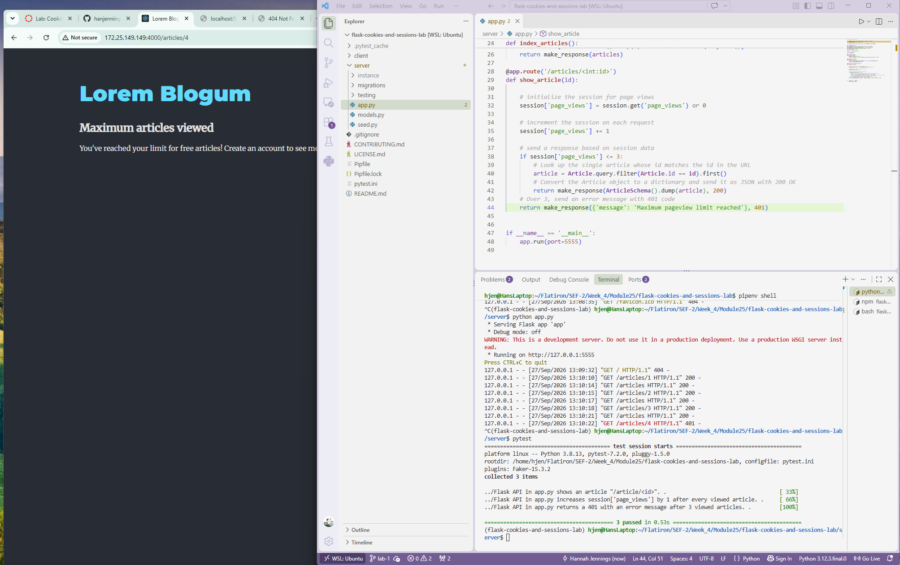

# Cookies and Sessions Lab: Blog Paywall
**Completed Sept 27, 2026** 

A Flask API backend with a React frontend that limits how many blog articles a user can read. Each user can view up to three articles for free. On the fourth, the server refuses to send the article and returns an error, and the frontend displays a paywall message.

## Why This Project Exists

The paywall was originally enforced only in the React frontend, so users could bypass it with browser dev tools. This version moves the limit to the backend. The page-view count is stored in Flask's `session`, which lives in a cookie signed with the app's secret key. Users can see the cookie, but if they edit it, the signature no longer matches and Flask rejects it. Because the server decides whether to send each article, blocked content never reaches the browser.

## Features

- Tracks each user's article views with `session['page_views']`
- Returns article data as JSON for the first three views
- Returns a `401 Unauthorized` response with an error message after three views
- Provides a `/clear` endpoint to reset the count during testing

## Installation

Clone the repository and move into it:

````bash
git clone https://github.com/hanjennings1/flask-cookies-and-sessions-lab.git
cd flask-cookies-and-sessions-lab
````

Install the dependencies and enter the virtual environment:

````bash
pipenv install && pipenv shell
npm install --prefix client
````

Create and seed the database:

````bash
cd server
flask db upgrade
python seed.py
````

## Usage

Start the Flask API from the `server` folder. It runs at http://localhost:5555.

````bash
python app.py
````

In a second terminal, start the React app from the project root. It runs at http://localhost:4000.

````bash
npm start --prefix client
````

Open http://localhost:4000 and click on articles. The first three open normally. The fourth shows "Maximum articles viewed." To reset your count, visit http://localhost:5555/clear.

## API Endpoints

| Method | Endpoint | Description |
| ------ | -------- | ----------- |
| GET | `/articles` | Returns all articles. Not limited by the paywall. |
| GET | `/articles/<id>` | Returns one article if the user has viewed 3 or fewer. Otherwise returns `{"message": "Maximum pageview limit reached"}` with status 401. |
| GET | `/clear` | Resets `session['page_views']` to 0. |

## How It Works

Each request to `/articles/<id>` runs through three steps in `server/app.py`:

1. If the user has no page-view count yet, it starts at 0.
2. The count increases by 1 for this visit.
3. If the count is 3 or less, the article is returned with status 200. If it's more than 3, the error message is returned with status 401.

## Screenshot

The React app showing the paywall message (left), and the Flask server log (right) showing three successful article requests (200) followed by a blocked fourth request (401):



## Running Tests

From the `server` folder, with the virtual environment active:

````bash
pytest -x
````

All 3 tests pass.

## Project Structure

````
flask-cookies-and-sessions-lab/
├── client/              # React frontend (no changes needed)
├── server/
│   ├── app.py           # Flask routes, including the paywall logic
│   ├── models.py        # Article and User models and schemas
│   ├── seed.py          # Sample data for the database
│   ├── migrations/      # Database migration files
│   └── testing/         # Test suite
├── cookies-and-sessions-lab.png
├── Pipfile
├── pytest.ini
└── README.md
````
